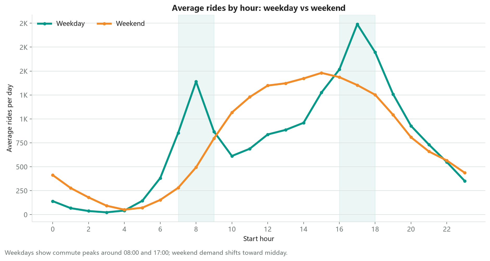
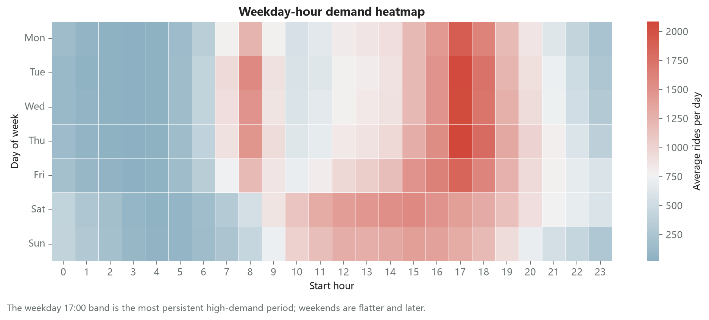
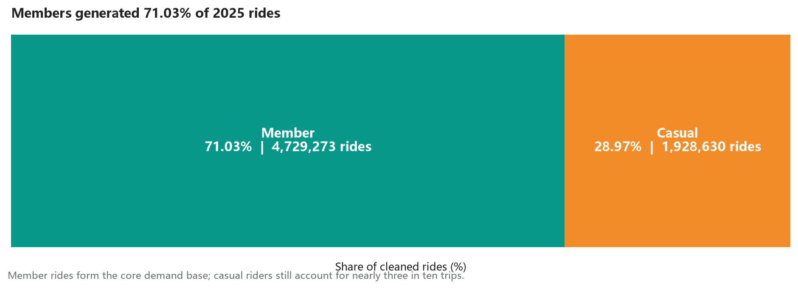
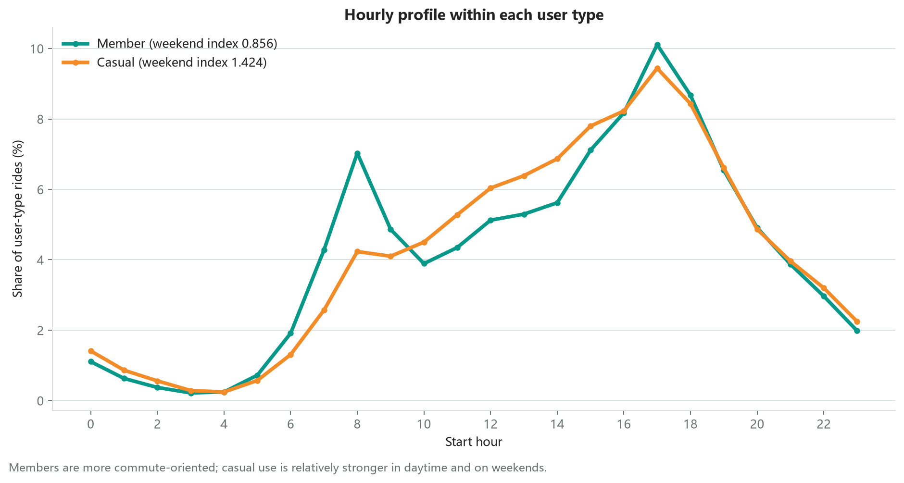
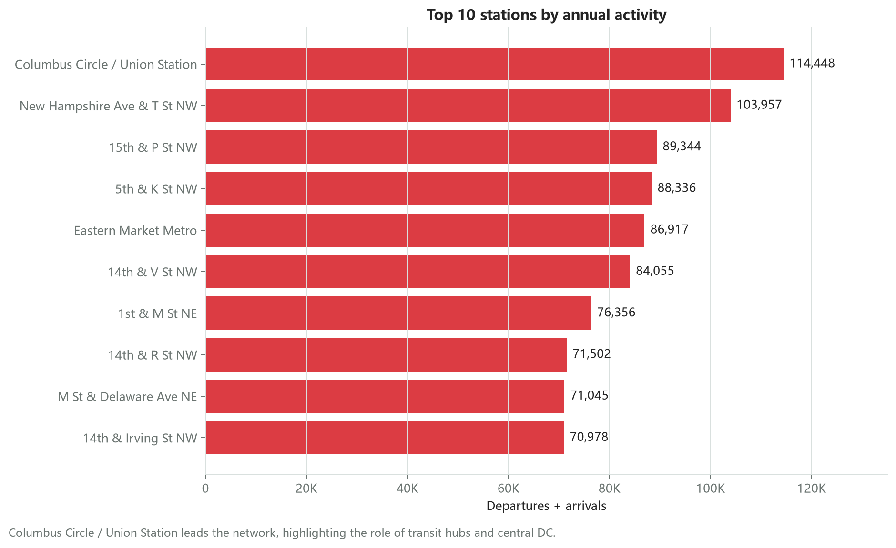
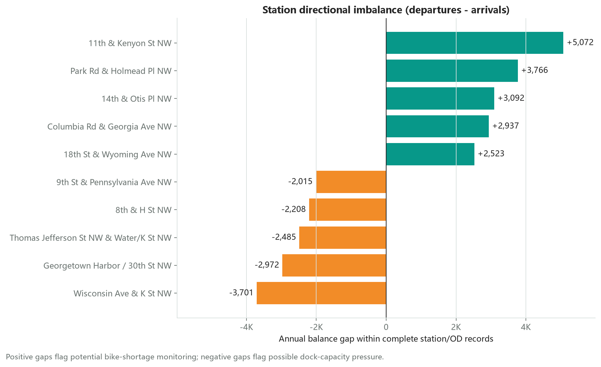
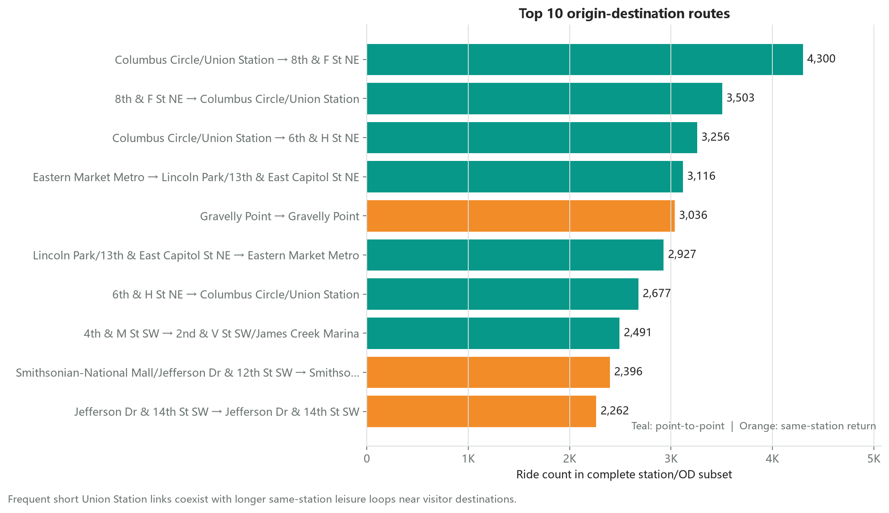
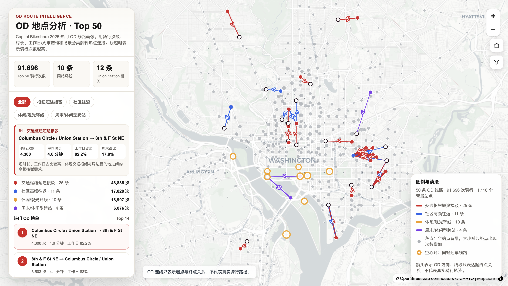

# Capital Bikeshare 2025 全年共享单车分析

这是一个面向数据分析实习求职展示的课程项目整理版。项目使用 Capital Bikeshare 2025 年 1-12 月官方骑行数据，以 **Python 分块处理 666 万条记录**，分析需求在时间、用户、站点和 OD（Origin-Destination）流向上的差异，并把结果转化为高峰保障、补车和清桩的运营线索。

| 招聘者快速了解 | 结果 |
| --- | ---: |
| 原始记录 | 6,662,647 |
| 清洗后记录 | 6,657,903（保留率 99.93%） |
| 完整 station/OD 子集 | 4,541,427（占清洗后记录 68.21%） |
| 分析站点键 | 1,108 |
| 唯一 OD 组合 | 164,786 |
| member 骑行占比 | 71.03% |

## 关键发现

- **工作日存在明显通勤双峰。** 08:00 左右出现早高峰，17:00 达到更强的晚高峰；周末曲线更平缓，需求转向中午至下午。
- **member 是系统主力，casual 更偏休闲。** member 贡献 4,729,273 次骑行，占 71.03%；member 周末日均强度 / 工作日为 0.856，casual 为 1.424。
- **热门站点集中在交通枢纽和中心城区。** Columbus Circle / Union Station 全年出发与到达合计 114,448 次，位居第一。
- **departures - arrivals 揭示方向性压力。** 出发偏多站点应优先监测缺车风险，到达偏多站点应关注满桩和车辆积压；年度差值是排查线索，不等同于实时库存短缺。
- **高频 OD 同时包含通勤接驳与休闲环线。** Union Station 周边短距离线路频率高；Gravelly Point、National Mall 等同站还车线路时长更长，更可能对应休闲或观光场景。

## 代表性图表



工作日 08:00 和 17:00 的通勤峰值清晰，周末需求则向午后移动。



周一至周五的 17:00 高需求带最稳定，周末日内分布更平缓、更晚。



member 贡献 71.03% 的全年骑行，是系统需求基本盘；casual 仍占接近三成。



member 的早晚高峰更突出，casual 在日间和周末相对更活跃。



Union Station 等交通枢纽和中心城区站点形成最高频的出发与到达节点。



正差值提示潜在缺车监测需求，负差值提示潜在满桩或清桩压力。



高频短距离接驳与长时同站休闲环线并存，说明系统同时服务通勤和休闲场景。



Top 50 OD 地图把起终点关系、线路频次和场景分类放在同一视图；可下载并在浏览器打开 [`docs/interactive_od_map.html`](docs/interactive_od_map.html) 进行探索（连线表示 OD 关系，不代表实际骑行轨迹）。

## 运营含义

1. **分时保障：** 工作日优先保障 07:00-09:00、16:00-18:00 的核心通勤站点；周末把巡检和调度能力向中午至下午移动。
2. **补车候选：** 将年度 departures 明显高于 arrivals 的高频站点纳入缺车监测清单，再结合小时规律与实时 GBFS 库存确定补车时段。
3. **清桩候选：** 对 arrivals 明显高于 departures 的站点重点监测空桩数量和车辆积压，避免用户到站后无法还车。
4. **差异化服务：** member 更需要稳定的通勤高峰可用性；casual 更需要景点、公园和日间热点周边的车辆可获得性及清晰引导。

## 数据处理与分析流程

`src/prepare_data.py` 保留了真实的大规模处理逻辑：

1. 自动发现 12 个按月 CSV/ZIP 文件，以 250,000 行为一个 chunk 流式读取；
2. 检查 13 个原始字段的名称、数量与顺序是否一致；
3. 解析 `started_at` / `ended_at`，计算 `duration_min`；
4. 按 `started_at` 保留 2025 年记录，删除非正时长、超过 24 小时和重复 `ride_id` 后续记录；
5. 构造月份、星期、小时、周末标记、站点键、OD 键和同站还车标记；
6. 区分三个分析分母：完整清洗主表、任一端站点有效记录、起终点站同时完整的 station/OD 子集；
7. 输出小型审计与聚合表。明细级输出默认关闭，避免意外生成或提交数百 MB 文件。

详细口径见 [`docs/methodology.md`](docs/methodology.md)，字段说明见 [`docs/data_dictionary.md`](docs/data_dictionary.md)。

## 仓库结构

```text
capital-bikeshare-2025-analysis/
├─ README.md
├─ requirements.txt
├─ src/
│  └─ prepare_data.py            # 12 个月数据清洗、审计与聚合
├─ analysis/
│  ├─ temporal_analysis.py       # 小时、工作日/周末、星期热力图
│  ├─ user_analysis.py           # member/casual 构成与时段差异
│  ├─ station_analysis.py        # 热门站点与出发-到达差值
│  ├─ od_analysis.py             # 高频 OD 线路
│  └─ run_all.py                 # 重绘全部静态图
├─ data/
│  ├─ README.md
│  └─ aggregates/                # 可公开的小型派生表与质量审计
├─ figures/                      # 8 张精选图表/地图预览
├─ docs/
│  ├─ data_dictionary.md
│  ├─ methodology.md
│  └─ interactive_od_map.html
└─ .gitignore                    # 排除原始/清洗明细和课程杂项
```

## 如何复现

### 1. 获取数据

从 [Capital Bikeshare System Data](https://capitalbikeshare.com/system-data) 下载 2025 年 1-12 月 trip history 文件，将 12 个 ZIP 或解压后的 CSV 放入 `data/raw/`。文件名应类似：

```text
data/raw/202501-capitalbikeshare-tripdata.zip
...
data/raw/202512-capitalbikeshare-tripdata.zip
```

### 2. 安装依赖并运行

```bash
python -m pip install -r requirements.txt
python src/prepare_data.py
python analysis/run_all.py
```

如确需在本地生成清洗后明细，可显式增加 `--write-row-level`；这些文件会写入被 `.gitignore` 排除的 `data/processed/`。

## 数据来源与公开说明

- 数据来源：[Capital Bikeshare System Data](https://capitalbikeshare.com/system-data)
- 数据许可：[Capital Bikeshare Data License Agreement](https://capitalbikeshare.com/data-license-agreement)
- 本仓库不包含原始或清洗后的明细骑行数据，仅包含分析代码、非商业分析所需的小型派生聚合表和可视化。
- Capital Bikeshare 官方说明原始 trip history 已移除工作人员/测试站骑行和疑似误操作的 60 秒以下骑行；本项目没有再次机械删除全部 1 分钟以下记录，而是将其纳入质量统计。
- 本项目与 Capital Bikeshare、Lyft 或其成员辖区无隶属、赞助或背书关系，未使用官方 Logo。

## 局限性

- station/OD 分析只覆盖起终点站信息同时完整的 68.21% 清洗后记录，且完整率存在月份差异。
- 未纳入天气、节假日、大型活动、实时 GBFS 库存、站点容量和实际调度记录。
- OD 连线只表示起点与终点关系，不是实际骑行路径；通勤/休闲属于基于时间、时长和地点的解释性判断。
- 年度 departures - arrivals 适合筛选运营关注对象，不能直接证明某一时刻缺车或满桩。

## 项目背景

原始分析形成于课程小组项目。本仓库是面向求职展示的公开整理版：已移除成员姓名、学号、课程封面、临时文件和大型明细数据，并保留可复现的清洗与分析证据。简历引用时应如实标注为团队项目，并按实际情况说明个人负责部分；不应将小组全部成果表述为个人独立完成。

## English summary

This portfolio project analyzes 6.66 million Capital Bikeshare trips from 2025 using a chunked Python pipeline. It covers data quality, temporal demand, member-versus-casual behavior, station activity, directional station imbalance, and origin-destination flows. The findings support time-aware rebalancing, bike availability monitoring, and dock-capacity management. Raw and row-level trip data are intentionally excluded.

